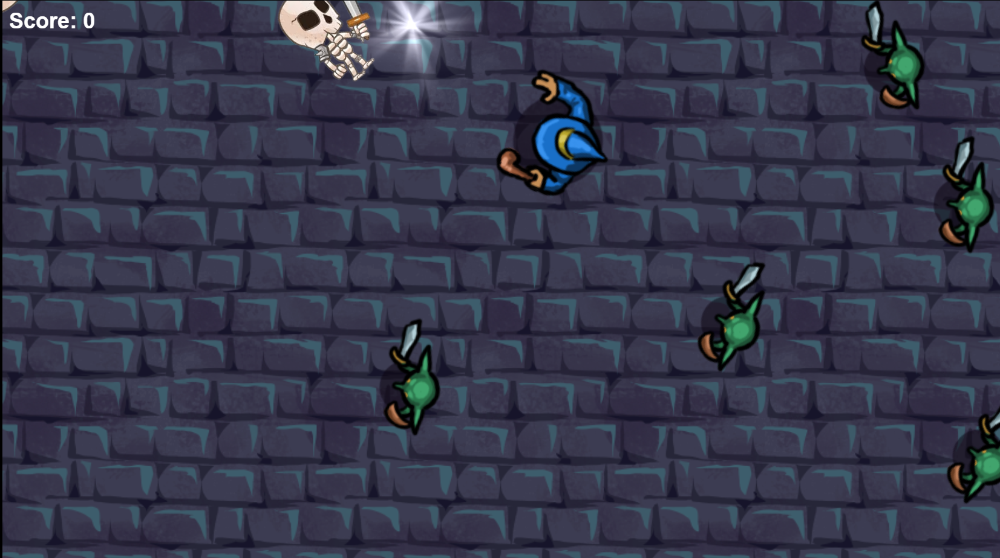
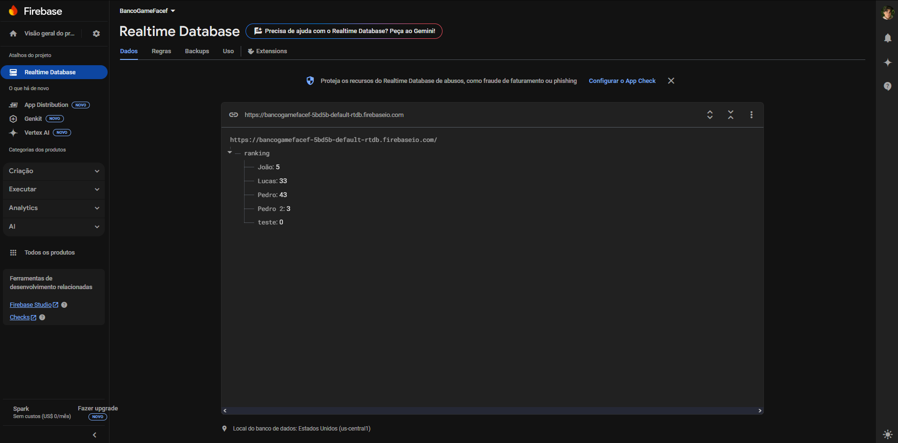

# 🎮 Battle Arena - RPG de Sobrevivência

## 🔗 Link do Jogo

https://wizard-game-xi.vercel.app

## 📖 Sobre o Jogo

Battle Arena é um jogo de ação em 2D de sobrevivência onde você controla um bravo mago que deve enfrentar hordas de monstros, incluindo goblins e esqueletos. Desenvolvido com Construct 3, o jogo apresenta mecânicas de combate dinâmicas, um sistema de pontuação e um ranking de jogadores.

## 🕹️ Jogabilidade

- Controle o jogador usando as teclas direcionais
- Atire magias nos inimigos com o clique do mouse
- Derrote goblins e esqueletos para ganhar pontos
- Sobreviva o máximo possível
- Registre sua pontuação no ranking global

## ⚔️ Características Principais

- **Combate Dinâmico**: Use magias para derrotar inimigos à distância
- **Inimigos Variados**: Enfrente diferentes tipos de monstros, cada um com comportamentos únicos
- **Sistema de Vida**: Tanto o jogador quanto os inimigos possuem sistema de vida
- **Pontuação Progressiva**: Acumule pontos ao derrotar inimigos
- **Dificuldade Crescente**: Mais inimigos aparecem conforme você avança no jogo
- **Ranking de Jogadores**: Compare sua pontuação com outros jogadores

## 👾 Inimigos

- **Goblins**: Inimigos rápidos, porém fracos, com 5 pontos de vida. Dão 1 ponto quando derrotados.
- **Esqueletos**: Inimigos mais resistentes e perigosos, com 10 pontos de vida. Dão 3 pontos quando derrotados.

## 🏆 Sistema de Ranking

O jogo possui um sistema de ranking que permite aos jogadores registrarem suas pontuações. Para participar:

1. Jogue até ser derrotado
2. Digite seu nome no campo de texto
3. Clique em "Enviar" para registrar sua pontuação
4. Veja como você se compara com outros jogadores

## 🖼️ Gráficos

O jogo apresenta gráficos 2D em estilo pixelart com um cenário de dungeon, personagens animados e efeitos visuais para as magias.

## 💻 Requisitos Técnicos

O jogo é desenvolvido para navegadores web e exige:

- Navegador moderno com suporte a HTML5
- Teclado e mouse
- Conexão com internet (para registrar pontuações no ranking)

## 🔧 Desenvolvimento

Desenvolvido com Construct 3, uma poderosa engine para criação de jogos 2D. O projeto utiliza:

- Sistema de física para movimento e colisões
- Efeitos visuais para magias e combate
- Sistema de eventos para controlar a lógica do jogo
- Integração AJAX para salvar pontuações

## 📲 Como Jogar

1. Acesse: https://wizard-game-xi.vercel.app
2. Use as teclas direcionais para movimentar o personagem
3. Clique com o mouse para atirar magias
4. Derrote inimigos para acumular pontos
5. Tente sobreviver o máximo possível!

---

- **Nome:** Pedro Paulino Martiniano
- **Código:** 25784

Desenvolvido como projeto para a disciplina de Desenvolvimento de Jogos.
